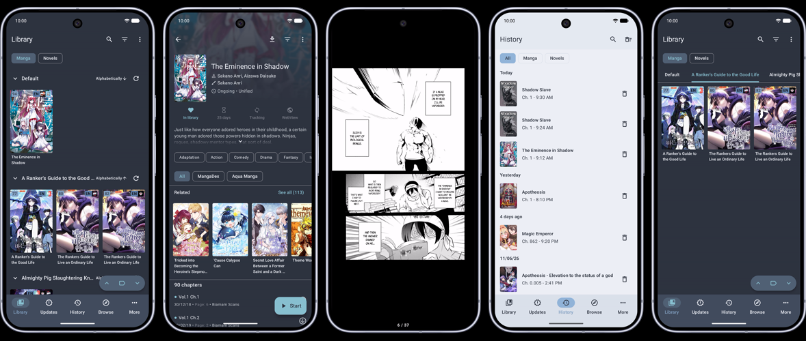

# Reikai

### One library for manga and light novels

A free and open source reader for Android, built on Mihon.

| Releases | Preview |
| :---: | :---: |
|   |   |

*Requires Android 8.0 or higher.*

 

## About

Reikai (霊界, "spirit world") is a personal manga and light-novel reader for Android, built on [Mihon](https://github.com/mihonapp/mihon) (Tachiyomi lineage). It started as a fork of [Yōkai](https://github.com/null2264/yokai) and was later rebased onto Mihon.

Two things set it apart from the lineage: **manga and light novels share one library** as equal content types, with the same layout and interactions; and it adds **multi-source power features** the lineage lacks, like folding the same series from several sources into a single entry, and ordering categories per library.

It is built first for my own daily use, so development is sporadic and the feature set follows my taste rather than a broad roadmap. It rides Mihon's actively maintained base for the core reader and layers these features on top.

**New here? Start with the [FAQ](docs/FAQ.md)**: what Reikai is, how updates work, where to download safely, and how sources behave.

## Features

### Reikai's own features

- `Multi-source grouping` (manga + novels): fold same-title entries from different sources into one card, with a per-source switcher. ([docs](docs/multi-source.md))
- `Manual merge / unmerge`: group entries by hand when titles differ, or split a group apart. ([docs](docs/multi-source.md))
- `Merge-aware reading`: read a merged series through every source, one unified chapter list. ([docs](docs/multi-source.md#reading-a-merged-group))
- `Tracker sync` across grouped sources: a tracker on one source is shared across the group. ([docs](docs/tracker-sync.md))
- `Category sort order` + `bulk delete`: order categories, and multi-delete with undo. ([docs](docs/categories.md))
- `Light novels`, first-class: a full Novels library equal to manga; sources + reader from [LNReader](https://github.com/LNReader/lnreader) on a headless QuickJS host; and track novels on AniList, MyAnimeList, MangaUpdates and Kitsu.
- `Taste-profile recommendations`: rank the related row by your tracked-tag preferences. ([docs](docs/related-mangas.md#taste-profile))
- `Cloudflare bypass` support: route a blocked source through a self-hosted proxy ([Byparr](https://github.com/ThePhaseless/Byparr) recommended, or FlareSolverr). ([docs](docs/flaresolverr.md))
- `Library update errors`: an opt-in list of entries that failed their last update.

<strong>From Yōkai</strong>

Carried over from [Yōkai](https://github.com/null2264/yokai) (Reikai's previous base, a [TachiyomiJ2K](https://github.com/Jays2Kings/tachiyomiJ2K)-lineage fork), re-typed onto Mihon:

- `Single-list library` + `category hopper`: a flat library layout with quick category jumping.
- `Dynamic grouping`: regroup the library on the fly by tag, author, source, status and more.
- `Cover-color theming`: tint the details screen from the cover art.

<strong>Adapted from Komikku</strong>

- `Related-mangas carousel`: similar titles below the description, from the source's related API, a keyword fallback, and tracker recs (AniList, MyAnimeList, MangaUpdates, Shikimori). From [Komikku](https://github.com/komikku-app/komikku); Reikai's taste layer is above. ([docs](docs/related-mangas.md))
- `Adult content sources`: [Komikku](https://github.com/komikku-app/komikku)'s adult-source subsystem, ported wholesale, built-in support, browse, tag search, metadata, account settings and backup, with some ported pieces tweaked and a few extra built-in sources added. Off by default. ([docs](docs/adult-sources.md))
- `Enhanced source support`: deep integration with one of the most-used manga sources, ported from [Komikku](https://github.com/komikku-app/komikku), sign in for source-native full details (author, status, description, star rating, namespaced tags), browse and bulk-add the titles you follow, track them with the built-in `MDList` tracker (two-way follow-status and rating sync), sync your library both ways, and open a random title.

<strong>From the Mihon base</strong>

The core manga experience is Mihon's (Tachiyomi lineage):

- Local reading of downloaded content.
- A configurable reader with multiple viewers, reading directions, and settings.
- Tracker support: [MyAnimeList](https://myanimelist.net/), [AniList](https://anilist.co/), [Kitsu](https://kitsu.app/), [MangaUpdates](https://www.mangaupdates.com/), [Shikimori](https://shikimori.one), [Bangumi](https://bgm.tv/), and [Hikka](https://hikka.io/).
- Categories to organize your library.
- Light and dark themes.
- Scheduled library updates.
- Local backups, or to your own cloud storage.
- Third-party extensions and repository management.

## Issues, Feature Requests and Contributing

This is a personal fork: pull requests are welcome, but a PR may take a while and might not be merged if it doesn't fit the fork's direction. For anything beyond a small fix, raise it first.

**New here? Start with the [FAQ](docs/FAQ.md).** Still stuck? Ask in [Q&A](https://github.com/unseensnick/Reikai/discussions/categories/q-a).

<strong>Bugs</strong>

* Include your Reikai version (More → About → Version), Android version, and device.
* Check the [changelog](https://github.com/unseensnick/Reikai/releases) and [open issues](https://github.com/unseensnick/Reikai/issues) first; it may already be fixed or tracked.
* Include steps to reproduce (if not obvious) and a screenshot if it helps.
* If it could be device-dependent, try another device if you can.

Use the [bug report form](https://github.com/unseensnick/Reikai/issues/new?template=2_report_issue.yml) to submit a bug.

<strong>Feature ideas and questions</strong>

Open a [Discussion](https://github.com/unseensnick/Reikai/discussions). Reikai is shaped around one person's use, so a request might be built as asked, built as a variation that fits better, or not built at all; talking it through first is the most useful path.

<strong>Contributing</strong>

See [CONTRIBUTING.md](./CONTRIBUTING.md). Reikai does not maintain or fix extensions/sources; problems with a specific source or extension are out of scope.

<strong>Code of Conduct</strong>

See [CODE_OF_CONDUCT.md](./CODE_OF_CONDUCT.md).

## Acknowledgements

Reikai is a personal fork and stands on the work of the projects it builds on and borrows from:

- [Mihon](https://github.com/mihonapp/mihon): the base it is built on.
- [Yōkai](https://github.com/null2264/yokai): the previous base, where several of the features were first built.
- [TachiyomiJ2K](https://github.com/Jays2Kings/tachiyomiJ2K): the single-list library and dynamic-grouping experience.
- [Komikku](https://github.com/komikku-app/komikku): the related-mangas carousel and the adult-source subsystem.
- [LNReader](https://github.com/LNReader/lnreader): the light-novel source format and reader.
- [Tachiyomi](https://github.com/tachiyomiorg) and its wider community, where the lineage began.

Thanks to everyone who contributed to those projects.

## Disclaimer

The developer of this application does not have any affiliation with the content providers available, and this application hosts zero content.

## License

<pre>
Copyright © 2015 Javier Tomás
Copyright © 2024 Mihon Open Source Project
Copyright © 2026 unseensnick

Licensed under the Apache License, Version 2.0 (the "License");
you may not use this file except in compliance with the License.
You may obtain a copy of the License at

http://www.apache.org/licenses/LICENSE-2.0

Unless required by applicable law or agreed to in writing, software
distributed under the License is distributed on an "AS IS" BASIS,
WITHOUT WARRANTIES OR CONDITIONS OF ANY KIND, either express or implied.
See the License for the specific language governing permissions and
limitations under the License.
</pre>

